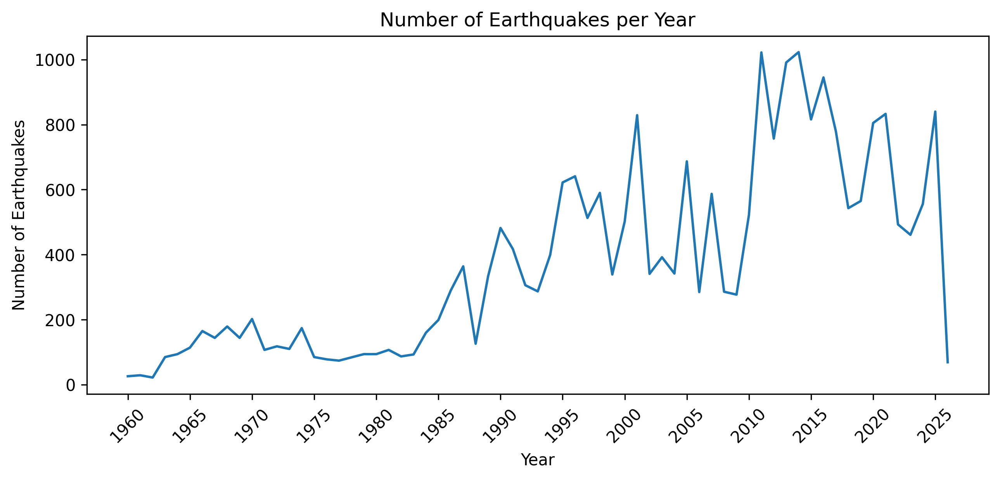
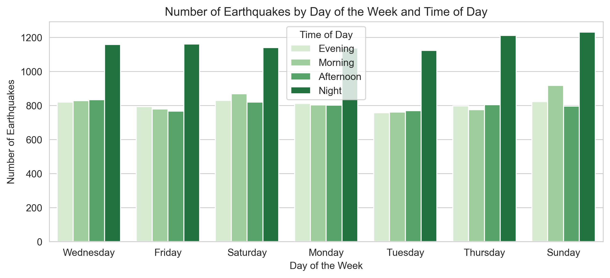
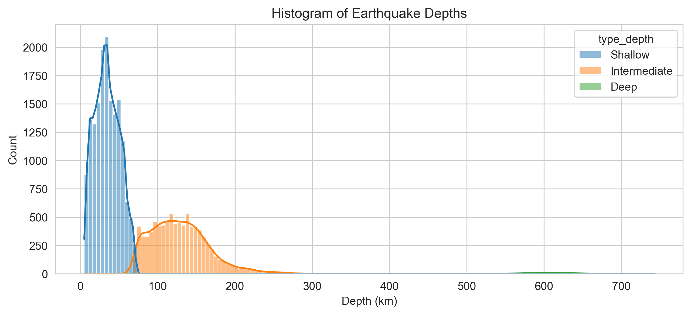
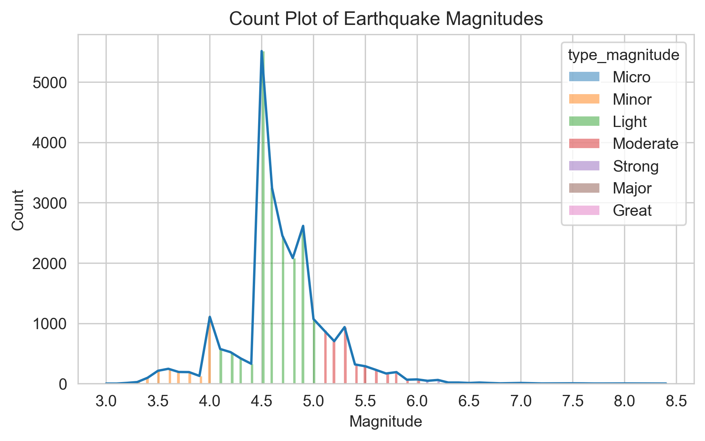
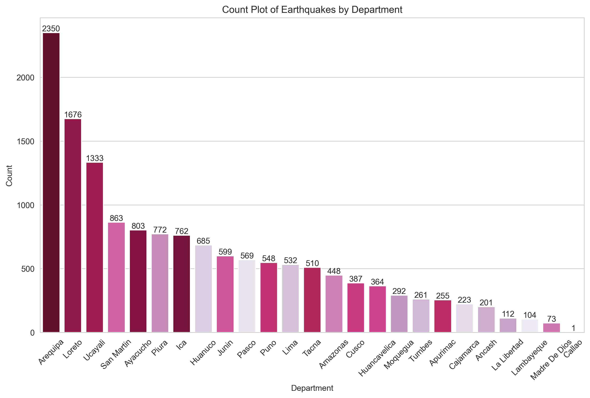
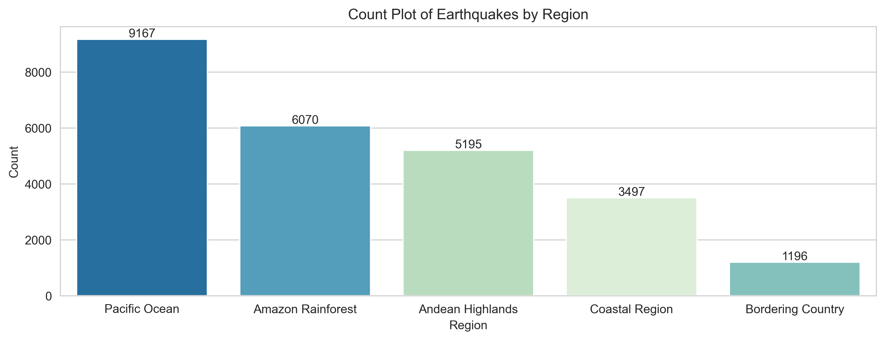
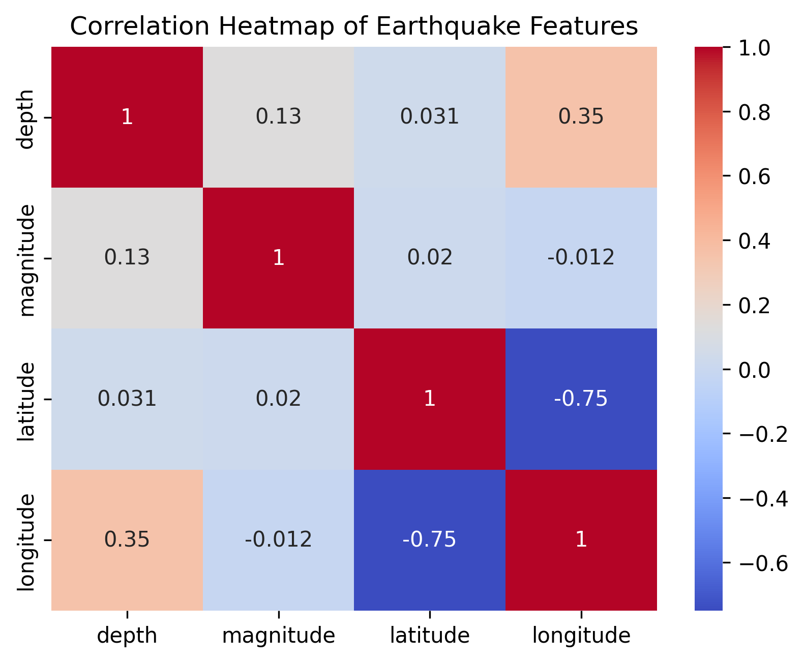
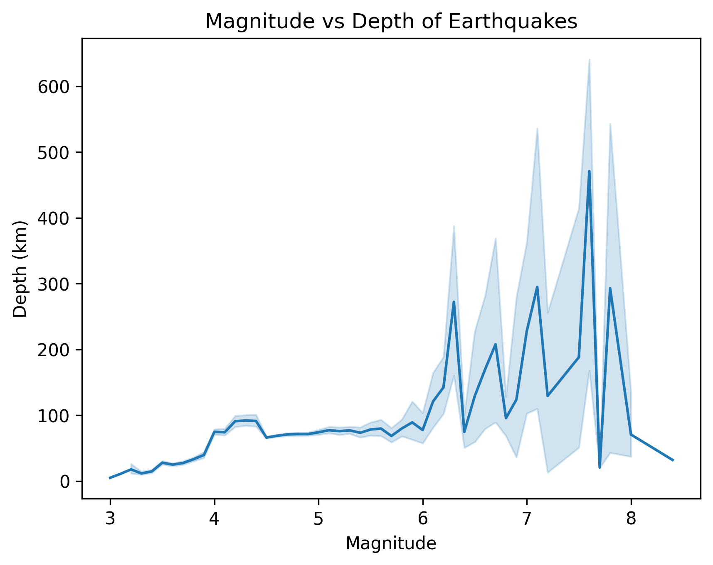

# Key Findings

In this project, I analyzed the dataset *“Earthquake Reports from 1960–2026”* from the National Seismological Center (CENSIS), which contains 25,125 records. The analysis did not reveal a strong relationship between earthquake depth, magnitude, latitude, and longitude. Although an apparent increase in recorded earthquakes is observed in recent years, this trend is likely explained by advances in monitoring technology that allow CENSIS to detect and register more events, rather than an actual increase in earthquake frequency.

## Important Graphs

### Earthquakes by Year

* The number of recorded earthquakes increases toward recent years. However, the pattern shows irregular behavior with noticeable peaks and valleys over time.

---

### Earthquakes by Day and Time

* Earthquakes appear across all days of the week. The most frequent time ranges are during the early morning (00:00–06:00) and evening hours (18:00–23:59).
* Further analysis would be required to determine whether this pattern reflects natural seismic behavior or data collection factors.

---

### Earthquake Depth

* Most earthquakes occur at shallow depths. Deep earthquakes are relatively rare and may be considered extreme values compared to the overall distribution.

---

### Earthquake Magnitudes

* The magnitude distribution shows that most earthquakes fall between 4.4 and 5.0, corresponding to light-to-moderate seismic events.

---

### Location

#### By Department

* The top three departments with the highest number of recorded earthquakes are Arequipa, Loreto, and Ucayali.

#### By Region

* Many earthquakes occur in the Pacific Ocean and may impact Peruvian territory.
* Within Peru, the Amazon region shows the highest number of recorded earthquakes, which may be partially explained by its larger geographic area compared to the Andean Highlands and Coastal regions.

---

### Depth vs. Magnitude

!

* The correlation heatmap suggests no strong relationship between depth and magnitude. The correlation observed between latitude and longitude is likely due to the geographic concentration of events within or near Peru.

* Although no clear correlation exists between magnitude and depth, higher-magnitude earthquakes appear across a wider range of depths.